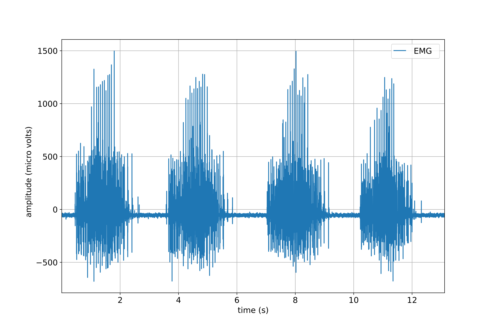
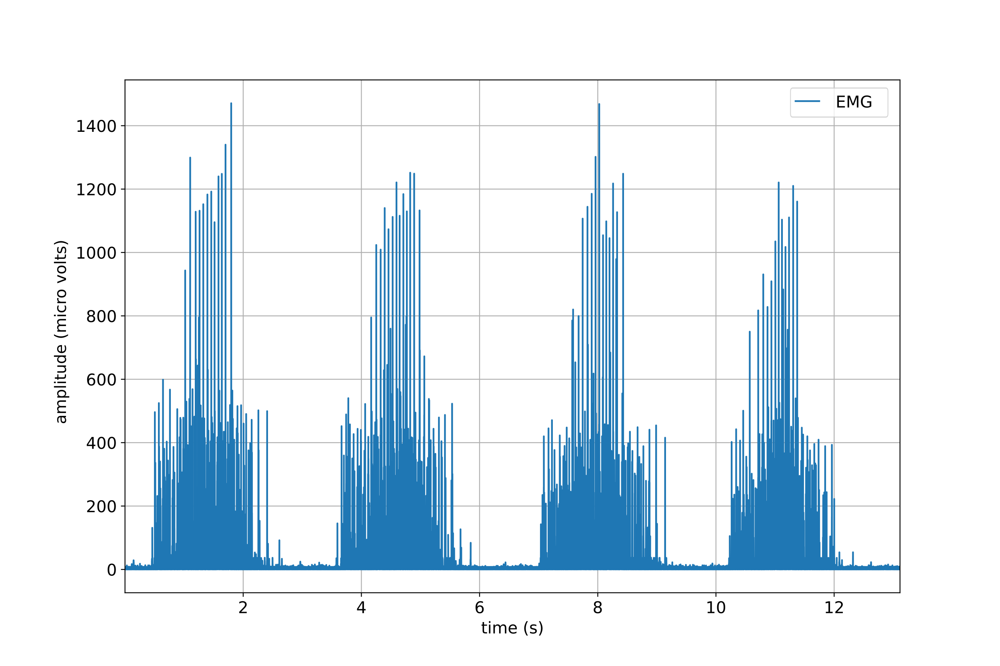

**spike2py** provides a simple interface to analyse and visualise data collected using [Spike2](http://ced.co.uk/products/spkovin) software and [Cambridge Electronics Design (CED)](http://ced.co.uk/) data acquisition boards. With it you can easily plot individual channels to as well as all channels from a given trial. In addition, you can easily apply various signal processing methods to your `waveform` data. Finally, you can easily save your data at any point, allowing you to re-open and continue your work from where they left off.

To demonstrate, the following snippet of code shows you how to:

1. Read a file
2. Plot the electromyography (EMG) signal from one of the channels
2. Remove the mean of the first 500 samples and rectify EMG signal, and plot the result

```python
>>> from spike2py.trial import TrialInfo, Trial
>>> trial_info = TrialInfo(file="sample.mat")
>>> sample = Trial(trial_info)
>>> sample.muscle_emg.remove_mean(first_n_samples=500).rect().plot()
```



