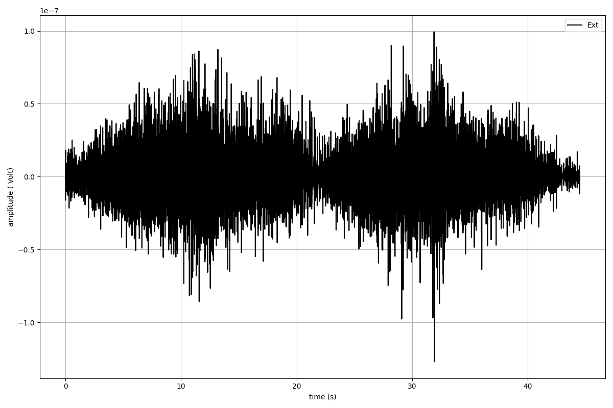
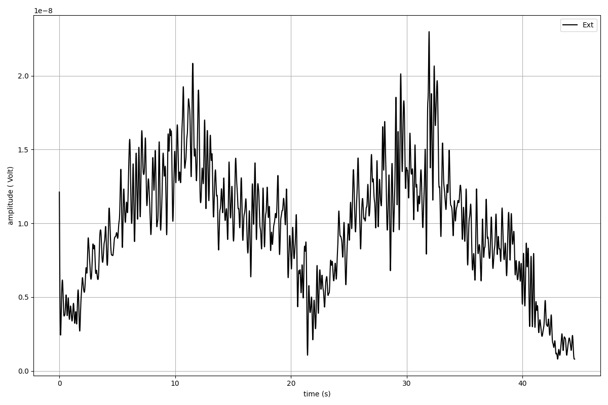

`spike2py`_ provides a simple interface to analyse and visualise data collected using `Spike2`_ software and `Cambridge Electronics Design (CED)`_ data acquisition boards.

Rather than read `.smr` files directly, `spike2py` reads `.mat` files exported from Spike2. `spike2py` assumes default export setting are used. This process is simplified by running `this script`_ to batch export all `.smr` files in a directory to `.mat` format.

`spike2py` simplifies reading and processing Spike2 data in Python. Users can easily generate individual channel plots, as well as a summary plot of all available channels. In addition, several signal processing methods (e.g. calibration, filtering, interpolating) are available for `waveform` (i.e. time-series) channels. Finally, trial data can be saved at any point, which allows users to open and continue processing their data from where they left off.

As a brief example, the following snippet of code shows how to:

1. Read a file
2. Perform signal processing on the `Ext` channel with EMG data
3. Plot the `Ext` channel before and after processing

>>> from spike2py.trial import TrialInfo, Trial
>>> trial_info = TrialInfo(file="sample.mat")
>>> sample = Trial(trial_info)
>>> sample.Ext.plot()
>>> sample.Ext.remove_mean().rect().lowpass(cutoff=5)
>>> sample.Ext.plot()

.. _spike2py: https://github.com/MartinHeroux/spike2py
.. _Spike2: http://ced.co.uk/products/spkovin
.. _Cambridge Electronics Design (CED): http://ced.co.uk/
.. _SonPy: http://ced.co.uk/upgrades/spike2sonpy
.. _scipy: .. _`scipy.io`: https://docs.scipy.org/doc/scipy/reference/io.html
.. _this script: https://github.com/MartinHeroux/Spike2-batch-export-to-Matab