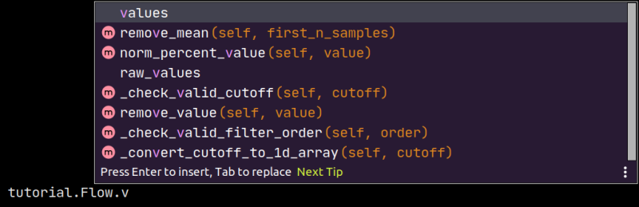
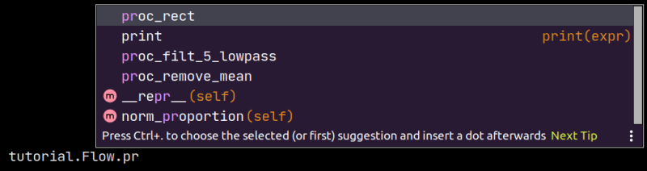

How To Guides
=============

.. _export:

Export Spike2 data to .mat
----------------------------

Rather than read `.smr` files directly, *spike2py* reads `.mat` files exported from Spike2.

*spike2py* assumes that you used the default export settings when you exported your data. The process of exporting your data to `.mat` files is made simpler by running `this Spike2 script`_, which batch exports all `.smr` files from a given directory to `.mat` format.

.. _import:

Import .mat files using spike2py
--------------------------------

With our Spike2 data exported to `.mat`, we are now ready to import our data into Python using *spike2py*. To do this we need two of the most important classes in *spike2py*: TrialInfo and Trial.

The most basic way to import our data is as follows:

.. code-block:: python

    >>> from spike2py.trial import TrialInfo, Trial
    >>> trial_info = TrialInfo(file='tutorial.mat')
    >>> tutorial = Trial(trial_info)

And now we have our data imported and accessible in the `tutorial` variable.

**But what if my data is not in the same folder?**

That is easy. We simply have to provide the full path to our file. For example, on Linux and Mac I would use:

.. code-block:: python

    >>> trial_info = TrialInfo(file='/home/martin/Desktop/tutorial.mat')

And on Windows I would use:

.. code-block:: python

    >>> trial_info = TrialInfo(file='C:\Users\Martin\Desktop\tutorial.mat')

.. _pathinfo:

Provide additional inputs to TrialInfo
--------------------------------------
`TrialInfo` requires that `file` be specified. If this is the only parameter that we provide, all other parameters will default to `None`. While this is fine if we are having a quick look at our data, we usually will want to specify a few more of the `TrialInfo` parameters.

If we import `TrialInfo` and create an instance with no inputs, we get the following:

.. code-block:: python

    >>> from spike2py.trial import TrialInfo
    >>> trial_info = TrialInfo()
    >>> trial_info
    TrialInfo(
	    file=None,
	    channels=None,
	    name=None,
	    subject_id=None,
	    path_save_figures=None,
	    path_save_trial=None,
    )

If we pass inputs to `TrialInfo`, we might get something like this:

.. code-block:: python

    >>> trial_info
    TrialInfo(
	    file='tremor_postural.mat',
	    channels=['Flow', 'Co2'],
	    name='fatigue_50max',
	    subject_id='sub001',
	    path_save_figures='/home/martin/Desktop/figures',
	    path_save_trial='/home/martin/Desktop/data',
    )

See the following sections for an explanation of each of these additional inputs and how they are used by *spike2py*.

Specify channels to import
~~~~~~~~~~~~~~~~~~~~~~~~~~
There may be times when we don't want to import all available channels. We can specify the channels we want to import by passing a list of channel names to TrialInfo.

For example, the following code imports only the `Flow`, and `Co2` channels from `tutorial.mat`:

.. code-block:: python

    >>> from spike2py.trial import TrialInfo, Trial
    >>> channels = ['Flow', 'Co2']
    >>> trial_info = TrialInfo(file='tutorial.mat', channels=channels)
    >>> tutorial = Trial(trial_info)
    >>> tutorial.channels
        [('Flow', 'waveform'), ('Co2', 'waveform')]

Note that we need to use the same spelling and capitalisation that we used in our Spike2 channel names.

Specify a trial name and a subject id
~~~~~~~~~~~~~~~~~~~~~~~~~~~~~~~~~~~~~
Depending on how we process our data and the additional files and figures we want to generate, it can be useful to have access to a human-readable trial name and the id of the subject from whom we collected the data.

.. code-block:: python

    >>> from spike2py.trial import TrialInfo, Trial
    >>> sub_id = 'sub001'
    >>> trial_name = 'fatigue_50max'
    >>> trial_info = TrialInfo(file='tutorial.mat',
                               name=trial_name,
                               subject_id=subject_id)
    >>> tutorial = Trial(trial_info)
    >>> tutorial.info.name
        'fatigue_50max'
    >>> tutorial.info.subject_id
        'sub001;

Specify paths to save figures and data
~~~~~~~~~~~~~~~~~~~~~~~~~~~~~~~~~~~~~~
By default, if we generate figures or save (i.e. pickle) our data, these will be stored in `figures` and `data` folders created in the folder that contains the `.mat` file we passed to `TrialInfo`. However, we can specify a folder for one or both of these. For example:

.. code-block:: python

    >>> from spike2py.trial import TrialInfo, Trial
    >>> path_save_figures='/home/martin/Desktop/nice_figures'
    >>> path_save_trial = '/home/martin/Documents/vault'
    >>> trial_info = TrialInfo(file='tutorial.mat',
                               path_save_figures=path_to_figures,
	                           path_save_trial=path_save_trial
	                           )
    >>> tutorial = Trial(trial_info)
    >>> tutorial.info.path_save_figures
        PosixPath('/home/martin/Desktop/nice_figures')
    >>> tutorial.info.path_save_trial
        PosixPath('/home/martin/Documents/vault')

The `PosixPath` part of the return value reflects the fact that *spike2py* uses `pathlib`_ to create and manage paths.

Apply signal processing steps to waveform channels
--------------------------------------------------

With **spike2py**, we can process our waveform signals with relative ease. While not all forms of signal processing are included, most of the common ones are.

As was demonstrated in the :ref:`tutorial`, signal processing steps can be chained together. For example:

.. code-block:: python

    >>> tutorial.Flow.remove_mean().lowpass(cutoff=5).rect()

And in case we want to compare processed and unprocessed data, or have them available for plotting, **spike2py** automatically creates a copy of the data and assigns it an informative name prior to applying each signal processing step.

Let's consider the processing we just applied to the `Flow` channel of the tutorial trial. When we first start, there is a `values` attribute and a `raw_values` attribute, and these are the same.

However, each signal processing step updates `values`. That is, `values` is always the most current version of our waveform signal.

At the same time, we might want to access the original raw signal. This is available in `raw_values`. Similarly, we have access to our waveform at each step of the processing pipeline. **spike2py** creates a copy of the waveform at each processing step and adds it as an attribute to the channel. This is done when we apply signal processing steps one at a time or all together as part of a chain. The names of these attributes all start with `proc_`. For example, here is what is available after we apply the processing pipeline from above:

Below is a list of the available signal processing steps. Click on their names to be taken to their full documentation.

:func:`~spike2py.sig_proc.SignalProcessing.remove_mean`: Subtract mean of first n samples (default is all samples)

:func:`~spike2py.sig_proc.SignalProcessing.remove_value`: Subtracts a value (e.g. an offset)

:func:`~spike2py.sig_proc.SignalProcessing.lowpass`: Apply dual-pass Butterworth lowpass filter

:func:`~spike2py.sig_proc.SignalProcessing.highpass`: Apply dual-pass Butterworth highpass filter

:func:`~spike2py.sig_proc.SignalProcessing.bandpass`: Apply dual-pass Butterworth bandpass filter

:func:`~spike2py.sig_proc.SignalProcessing.bandstop`: Apply dual-pass Butterworth bandstop filter

:func:`~spike2py.sig_proc.SignalProcessing.calibrate`: Calibrate using linear formula y=slope*x+offset, providing `slope` and `offset` values

:func:`~spike2py.sig_proc.SignalProcessing.norm_percentage`: Normalise data to be between 0-100%

:func:`~spike2py.sig_proc.SignalProcessing.norm_proportion`: Normalize data to be between 0-1

:func:`~spike2py.sig_proc.SignalProcessing.norm_percent_value`: Normalise data to a percentage of a provided value

:func:`~spike2py.sig_proc.SignalProcessing.rect`: Rectify data.

:func:`~spike2py.sig_proc.SignalProcessing.interp_new_times`: Interpolate datato a new time axis

:func:`~spike2py.sig_proc.SignalProcessing.interp_new_fs`: Interpolate datato a new sampling frequency

:func:`~spike2py.sig_proc.SignalProcessing.linear_detrend`: Remove linear trend from data

Run the **spike2py** test suite
-------------------------------
In order to run the **spike2py** testing suite, you will have to get the full **spike2py** from
`GitHub`_. You will also need to ensure you have the various requirements needed to run **spike2py**,
pytest, and the `pytest-mpl`_ plugin for pytest. All these packages and plugins are available
on Pypi and can be installed using pip.

`pytest-mpl` is a plugin that can be used to test figures that are generated with `matplotlib`_.

To run the full suite of tests and return the code coverage, run the following command from the root directory of the **spike2py**
package:

.. code-block:: shell

    $ pytest --mpl --cov=spike2py tests/

If you want to run all tests, except those that generate figures, you can run the following command:

.. code-block:: shell

    $ pytest -m 'not fig_gen'

Add tests to **spike2py**
-------------------------
If you have added some features to **spike2py**, please add tests that cover the new code.

All test files are located in the `tests` folder in the root directory of the **spike2py** package.

If your new feature was added to an existing module, please add your tests to the file named
`test_<module_name>.py`. For example, if you added something to the `trial.py` module, your test(s)
should go in `test_trial.py`.

Any new fixtures can be added to the `conftest.py` file.

If your tests need to access a `.mat` file, it can be added to the `payloads` directory located within the `tests` directory.

.. _this Spike2 script: https://github.com/MartinHeroux/Spike2-batch-export-to-Matab
.. _pathlib: https://docs.python.org/3/library/pathlib.html
.. _GitHub: https://github.com/MartinHeroux/spike2py
.. _pytest-mpl: https://pypi.org/project/pytest-mpl/
.. _matplotlib: https://matplotlib.org/
.. _README.md: https://github.com/matplotlib/pytest-mpl
