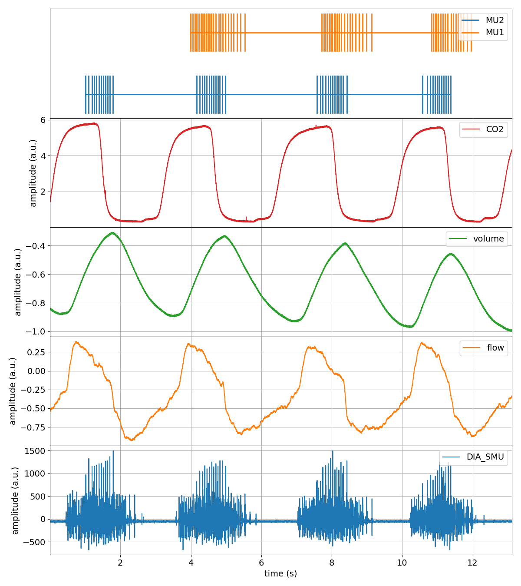
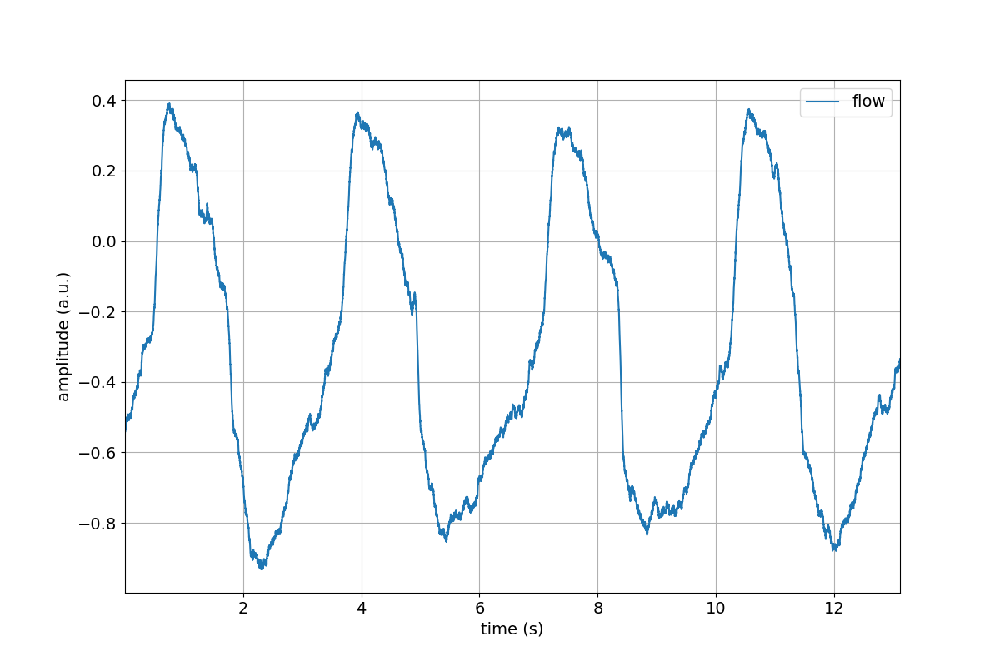
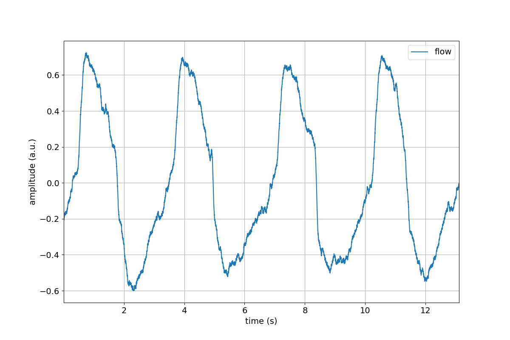
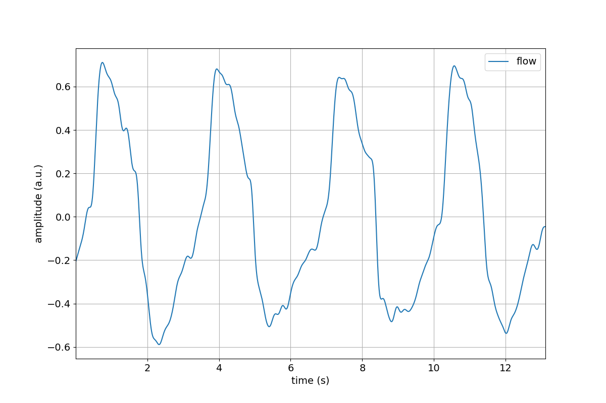
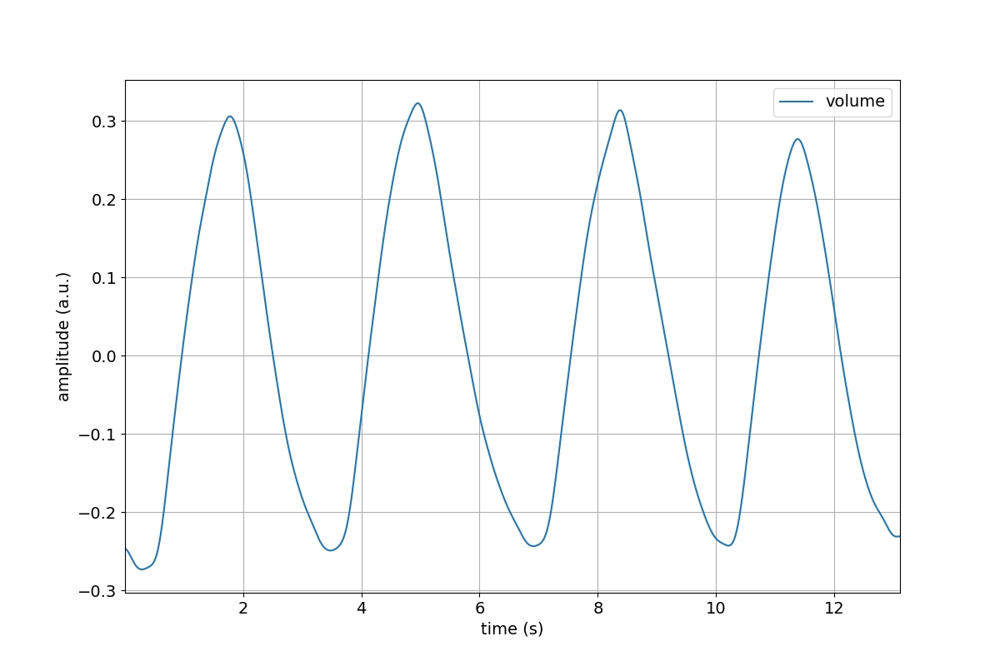
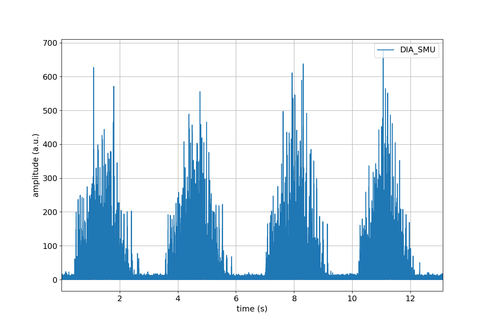
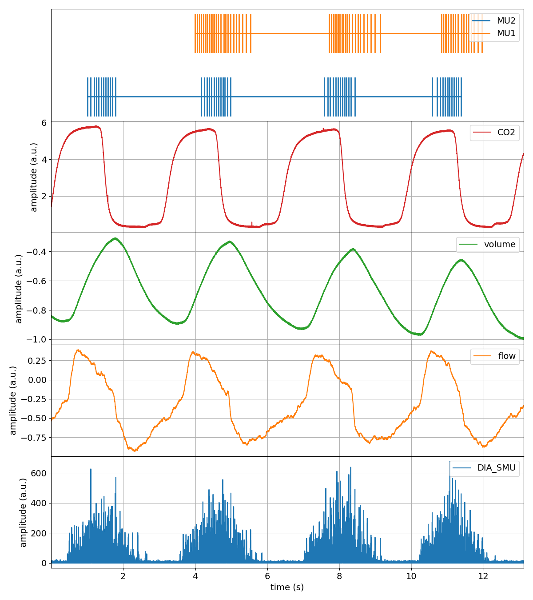

Tutorial
========

This tutorial will get you up and running with spike2py in 10 min.

Part 1. Import spike2py and load tutorial dataset
-------------------------------------------------
To get up and running quickly, spike2py ships with a tutorial dataset, which we will use in this tutorial. So the first thing we need to do is import spike2py and load the sample dataset.

With the virtual environment you created during the :ref:`installation` activated, start Python and type the following:

.. code-block:: python

    >>> import spike2py as sp
    >>> tutorial = sp.demo.tutorial_data()

Part 2. Inspect the tutorial dataset
------------------------------------
`tutorial` represent a trial recorded with Spike2. By default, spike2py imports all of the channels present in the `.mat` file. These channels appear as attributes of our trial.

Our tutorial dataset has six channels:

* Dia_Smu
* Flow
* Volume
* Co2
* Mu1
* Mu2

In your Python interactive shell, type `tutorial.` and hit the tab key.
This will show you the various attributes and methods that belong to `tutorial`.

.. code-block:: python

   >>> import spike2py as sp
   >>> tutorial = sp.tutorial_data()
   >>> tutorial.
   tutorial.Co2       tutorial.Flow      tutorial.Mu2       tutorial.channels  tutorial.plot(
   tutorial.Dia_Smu   tutorial.Mu1       tutorial.Volume    tutorial.info      tutorial.save(

As you can, all of our channels are present.

There are also two additional attributes and two methods. The two attributes are `tutorial.channels` and `tutorial.info`. They contain basic information about the trial and its channels. If you are curious, type `tutorial.channels` or `tutorial.info` and then hit Return to see what they contain.

These two methods are very useful. They allow you to plot all channels on a single figure, and to save your data and continue your work from where you left off.

Part 3. Plotting our tutorial trial
-----------------------------------
To understand and interpret scientific data, it is often best to visualise it. Plotting data gives immediate feedback about the trial. It also gives immediate feedback about the various signal processing methods that we apply to individual channels.

That is why spike2py trials come with a built-in plotting method. Although relatively basic, it plots all of a trials channels on the same figure. Lets give it a try.

.. code-block:: python

    >>> tutorial.plot()

That was pretty easy!

But some of our channels require cleaning up. We need to apply basic signal processing methods to filter out high-frequency noise, zero the data, and remove a linear trend. Let's tackle that next.

Part 4. Processing some of our channels
---------------------------------------
Spike2 refers to channels that contain time-series data as `waveform` channels. To simplify things, spike2py includes several signal processing methods that can be applied to `waveform` channels.

Applying one method at a time
~~~~~~~~~~~~~~~~~~~~~~~~~~~~~
Let's start off by by removing the mean from the `Flow` channel. To validate our work, let's visualise the `Flow` channel before and after the mean has been removed by calling the its `plot` method.

.. code-block:: python

    >>> tutorial.Flow.plot()
    >>> tutorial.Flow.remove_mean()
    >>> tutorial.Flow.remove_mean().plot()

Great, we successfully removed the mean value from the `Flow` channel.

But there is some unwanted high-frequency noise on the signal. Let's get rid of that using a low-pass filter. Once again, let's visualise things to verify our work.

.. code-block:: python

    >>> tutorial.Flow.lowpass(cutoff=5)
    >>> tutorial.plot()

Chaining our methods
~~~~~~~~~~~~~~~~~~~~
That was all pretty simple. Let's now look at one of spike2py's super powers: method chaining!
Method chaining allows us to apply a series of signal processing steps, applying each step to the output of the previous step.

For example, let's apply the following signal processing steps to the `volume` channel:

* remove mean
* 4Hz low-pass filter
* linear detrend

And let's also plot the output.

.. code-block:: python

    >>> tutorial.Volume.remove_mean().lowpass(cutoff=4).linear_detrend().plot()

Compare the above figure to the `volume` channel in the trial figure we created in the Part 3 of this tutorial. The ability to Chain processing steps is terse and powerful!

To provide another examples, lets process the `Dia_Smu` channel, which consists of indwelling recordings of the diaphragm muscle. For this channel, we will:

* Apply a 20-450Hz band-pass filter
* rectify

Part 5. Save your progress, and start from where you left off
-------------------------------------------------------------
Great work! Hopefully you are following along and are starting to feel comfortable with the basics of spike2py. Now that we have imported our trial and done some basic signal processing, it might be a good time to save our trial so that we can start from this point the next time we want to work on this data.

This is very simple. Let's type the following line:

.. code-block:: python

    >>> tutorial.save()

That was easy. We just saved (pickled) our data to a Python binary file format that has the file extension `.pkl`). But where did we save it? The file was saved in the directory listed in `tutorial.info.path_save_trial`. This path default to a directory called `data` created in the directory from where we imported our tutorial dataset.

So, if our dataset was located here:

   `/home/madeleine/Desktop/tutorial.mat`

Our pickled data would be located here:

   `/home/madeleine/Desktop/data/tutorial.pkl`

Now lets delete the `tutorial` object from our Python session to simulate the next the next time we site down to continue our work.

.. code-block:: python

   >>> tutorial = sp.trial.load(file='/home/madeleine/Desktop/data/tutorial.pkl')

That's it. We now have our tutorial trial where we left off. We can confirm this by plotting the entire trial again, noticing that the `Flow`, `Volume` and `Dia_Smu` are indeed processed.

Now what?
---------
Hopefully you were able to follow along and learned the basics of spike2py. You should be almost ready to analyse your own data with spike2py. You are only missing two small steps:

* :ref:`export`
* :ref:`import`
